# Reto 2

Identifica los elementos de navegación en los siguientes sitios:

* **Breather**
* **Github**
* **Medium**

## Objetivo
El reto consiste en explicar que elementos de navegación de las paginas web Breather , Github y Medium.

**Breather:**

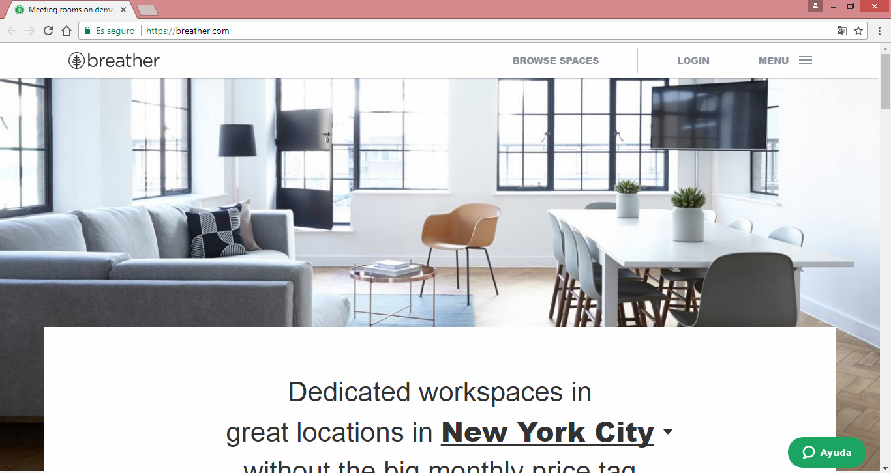
* **Navegación Global :** _Es la navegación principal del sitio._

* **Navegación Local :** _Es la navegación “localizada” a una página o vista.(En este caso es cuando elegimos en menu - see all cities - New york)_
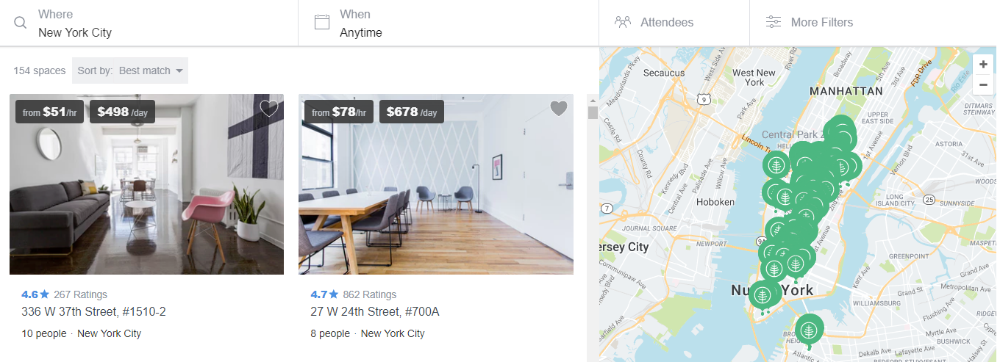
 _En la siguiente imágen tenemos multiples opciones about ,markets , benefits , security , funding , clients , FAQ o Press_
 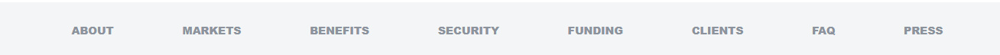
 _cuando elegimos about (seria navegación local)_
 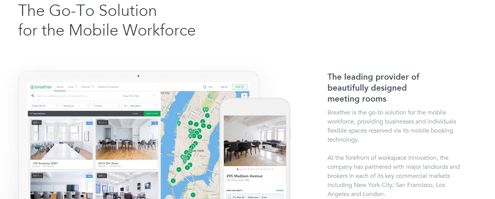

* **Navegación Facetada :** _Es la navegación a través de filtros no editables, definidos previamente por el sistema.( En este caso es cuando elegimos una opcion en este caso team meeting)_
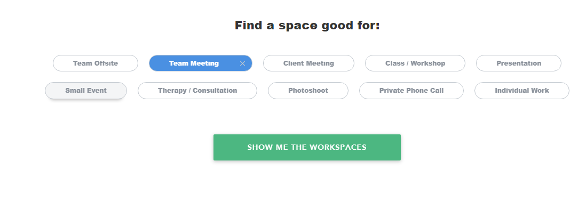

* **Navegación Filtrada :** _En este tipo de navegación le damos al usuario todos los resultados de la búsqueda y le damos una serie de opciones de filtros para que él mismo pueda filtrar.(En este caso es cuando elegimos el where , when , attendees y more filters que son filtros ya definidos)_
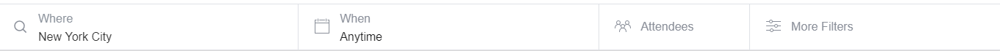

* **Navegación Contextual :** _Es la navegación acorde al contexto en el que está navegando el usuario. Se usa principalmente para recomendaciones.(En este caso es cuando elegimos Case Studies)_

* **Navegación inline :** _Son links de referencia (en este caso es Learn more ...)_
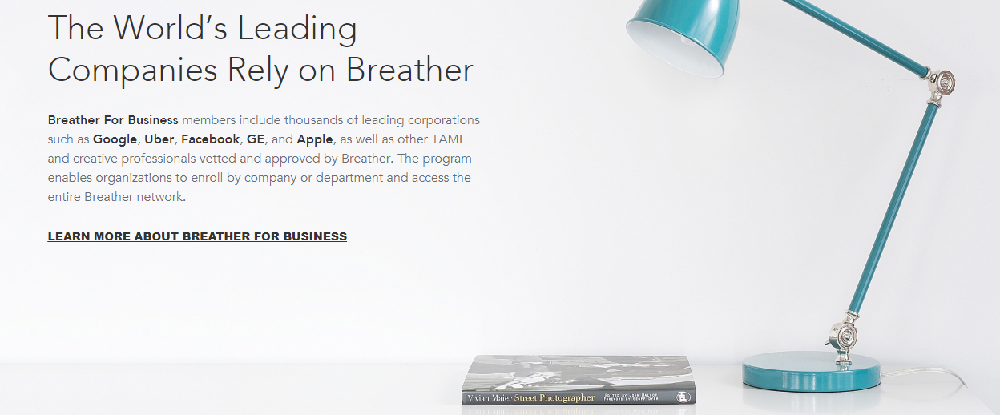

**Github:**

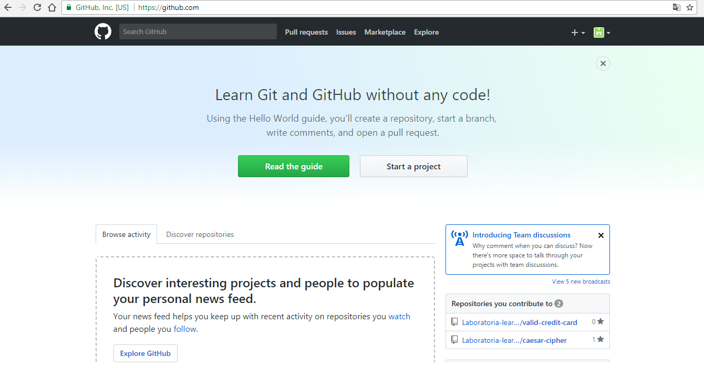
* **Navegación Global :** _Es la navegación principal del sitio._

* **Navegación Local :** _Es la navegación “localizada” a una página o vista.(En este caso es cuando elegimos el perfil)_
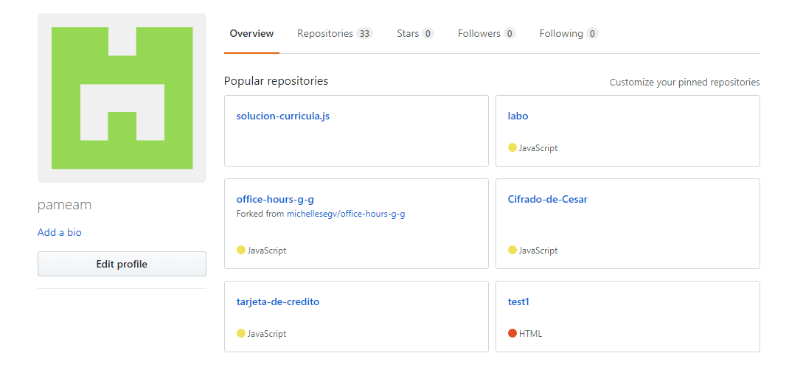

* **Navegación Facetada :** _Es la navegación a través de filtros no editables, definidos previamente por el sistema.( En este caso es cuando elegimos repositories)_
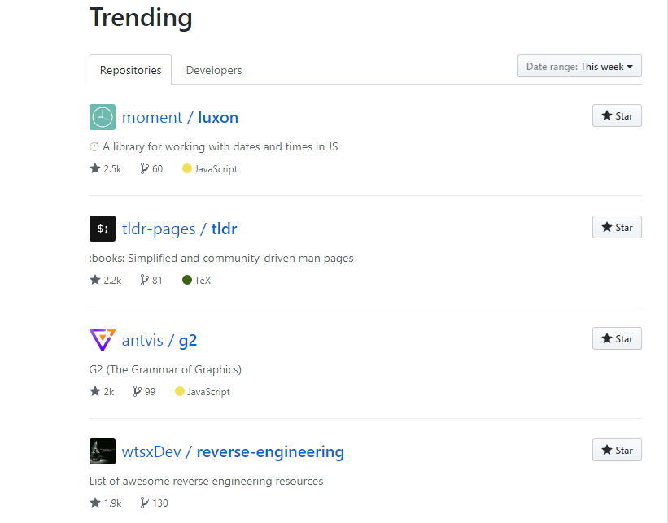
_En este caso es cuando elegimos private_
 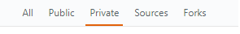

* **Navegación Filtrada :** _En este tipo de navegación le damos al usuario todos los resultados de la búsqueda y le damos una serie de opciones de filtros para que él mismo pueda filtrar._
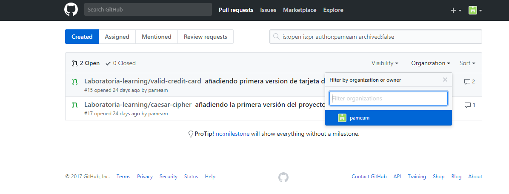

* **Navegación Contextual :** _Es la navegación acorde al contexto en el que está navegando el usuario. Se usa principalmente para recomendaciones.(En este caso collections)_
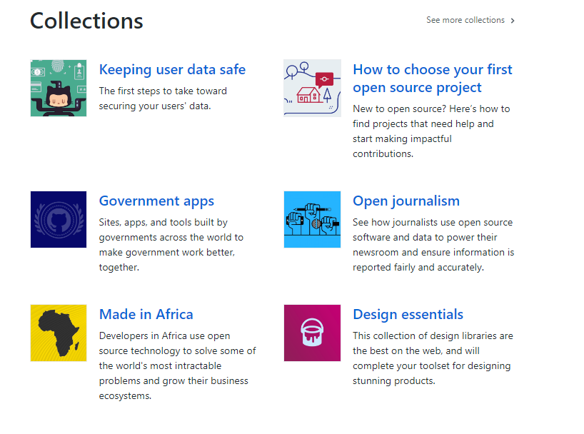

* **Navegación inline :** _Son links de referencia (en este caso es A Definitions)_
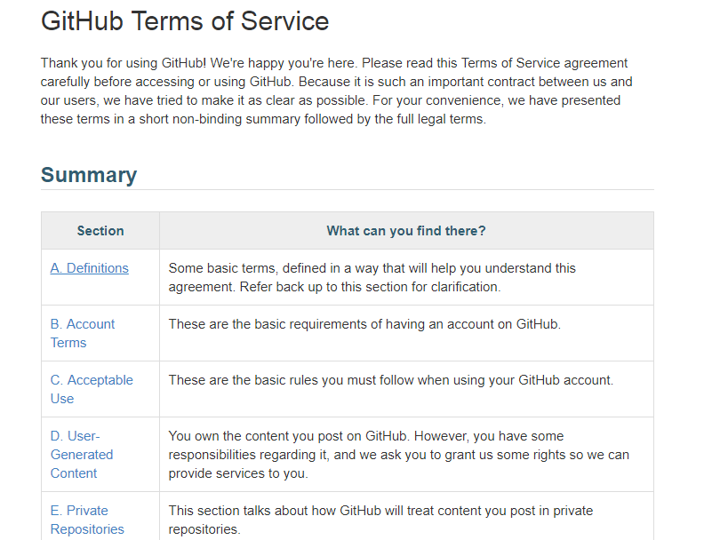

**Medium:**

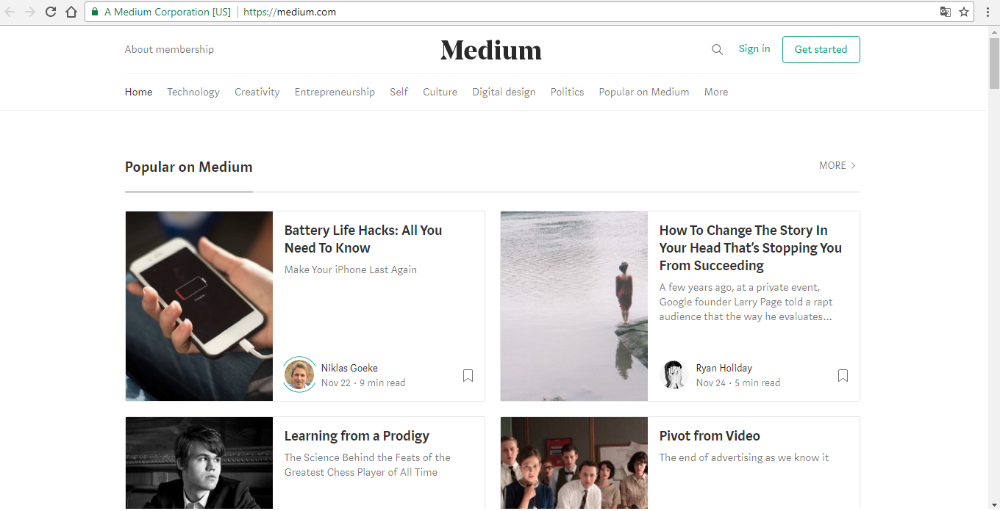
* **Navegación Global :** _Es la navegación principal del sitio._
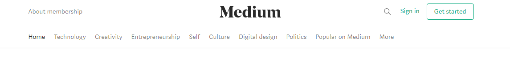

* **Navegación Local :** _Es la navegación “localizada” a una página o vista.(En este caso es cuando elegimos technology)_
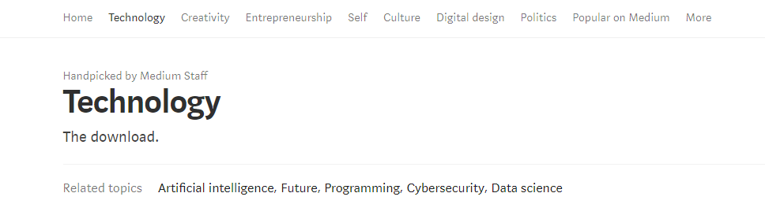

* **Navegación Facetada :** _Es la navegación a través de filtros no editables, definidos previamente por el sistema._

* **Navegación inline :** _Son links de referencia (en este caso es video clip)_
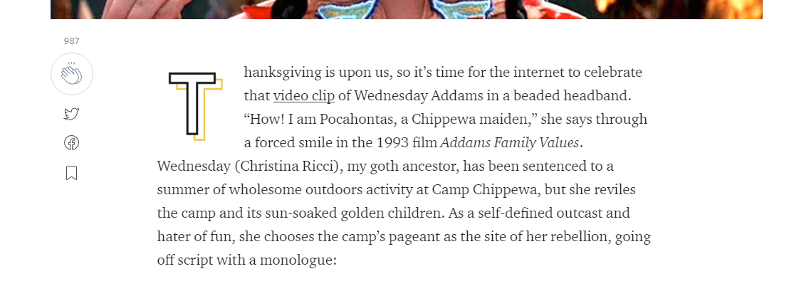
